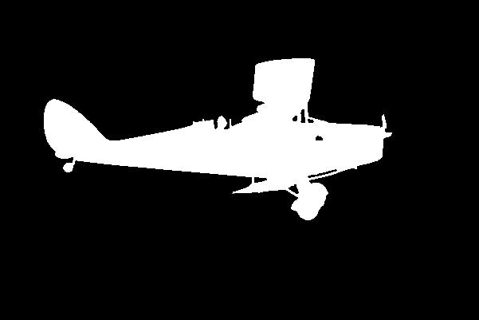
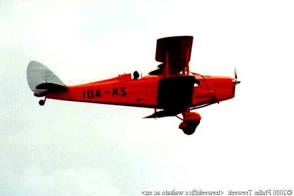
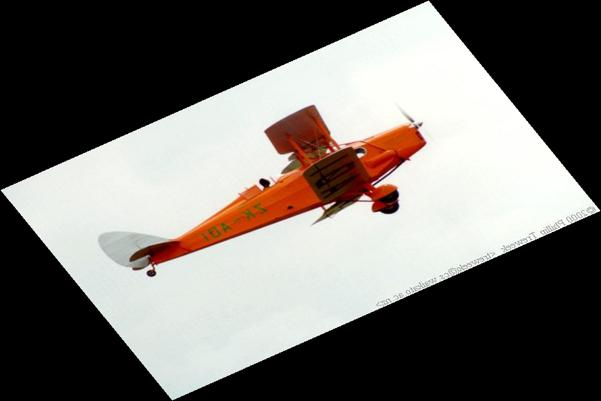
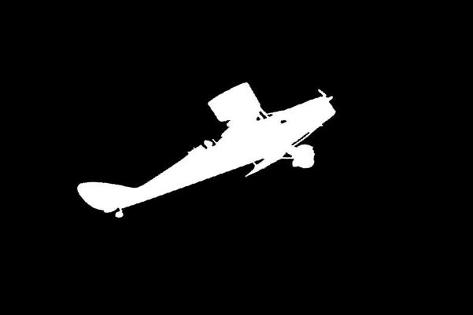
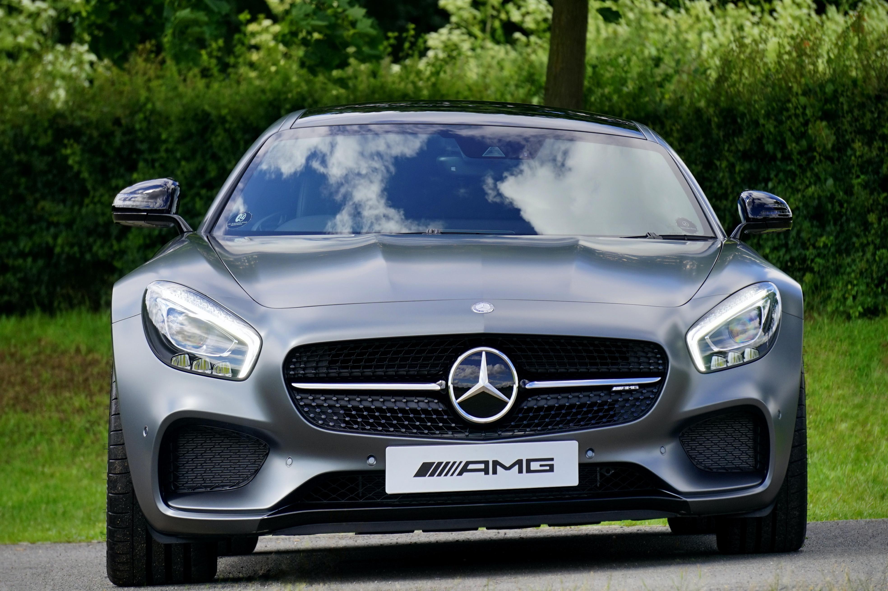
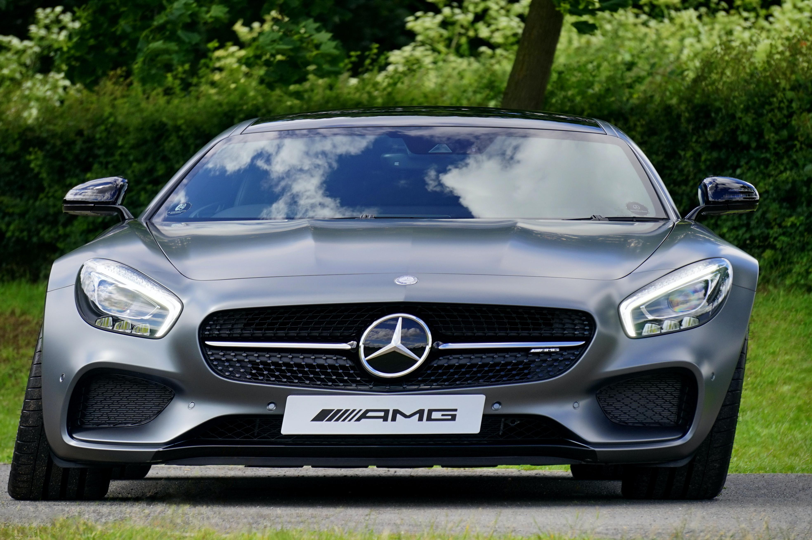
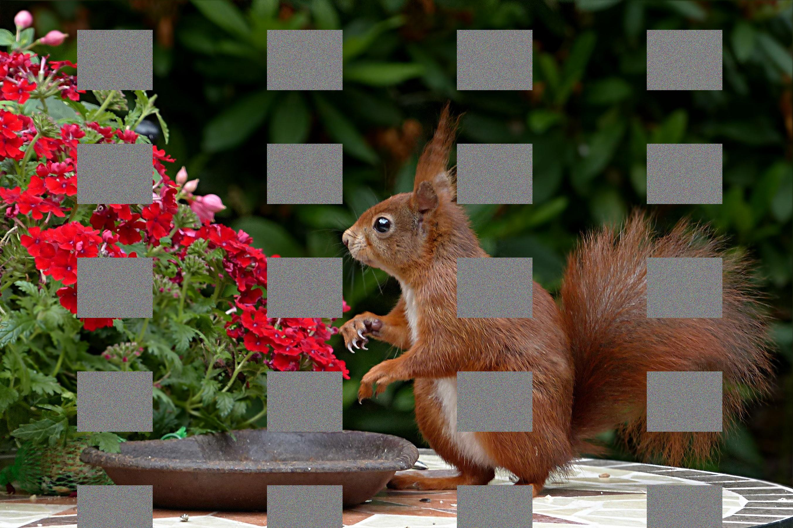

# Augmentation on the fly
[](LICENSE.md)

Library to perform augmentation of images for training deep learning models during the training stage. The 
transformations will be performed in the pre-processing step.

This library is an alternative to <a href=https://github.com/mdbloice/Augmentor> Augmentor </a>, which performs 
image augmentations to be stored in memory or creates an ready to use generator
for some of the main deep learning frameworks. However, there are cases where you do not want
to store the images in memory and still use your own generator.

## Quick start guide
The purpose of this repository is to create a small library to perform image augmentation
for training deep learning networks in a flexible manner.

There are two main steps:
1. Selection of the type of augmentation and parameters.
2. Call the run function to apply to a given image.
 

## Selection of the transformation and parameters
Currently, all the operations require a range of values for each of the parameters.
This range is specified with the minimum value and maximum value that the user wants
to use. For instance, the rotation of an image would required 2 values the minimum angle
and the maximum angle. Then, an uniform distribution will be used to select a value from
the range.

In addition, most of the parameterers that represents the size (for instance translation of an image)
are going to be represented relative to the image size, so their value will be between 0 and 1.
Thus, parameters from operations like the crop that requires the size of the patch in the image is given by
number between 0 and 1. In the case of crop 4 values will be required representing the minimum width, maximum width
minimum height and maximum height, all of them relative to the image size.

A list of the current operations and parameters is:

- <b>brightness</b>: (min_value, max_value) The values must for brightness must be between 0.05 and 10
- <b>color_balance</b>: (min_value, max_value) color_balance must be between 0 and 10
- <b>contrast</b>: (min_value, max_value) contrast must be between 0 and 10
- <b>flip</b>: 'horizontal' or 'hor', 'vertical' or 'ver', both
- <b>greyscale</b>: []
- <b>grid_mask</b>: (min_x_pos, max_x_pos, min_y_pos, max_y_pos, min_width_square, max_width_square,
            min_height_square, max_heigth_square, min_x_distance_between_squares,
            max_x_distance_between_squares, min_y_distance_between_squares, max_y_distance_between_squares)
            Values must be between 0 to 1 sinc they are relative to the size of the image.
            Generally, the initial position should be similar to the distance between squares
            This type of augmentations can be used two o three times with different parameters, since it is
            good to have a lot of different grids without having too much of the image covered.
- <b>illumination</b>: (min_radius, max_radius, min_magnitude, max_magnitude)  -- standard (0.05, 0.1, 100, 200)
- <b>noise</b>: (min_sigma, max_sigma) -- gaussian noise wiht mean 0
- <b>occlusion</b>: (type, min_height, max_height, min_width, max_width)  - creates a box of noise to block the image.
        The types are hide_and_seek and cutout so far. It has two extra parameters: 
  1. `num_patches`: It can be a number or a range and by default is 1.
  2. `use_colour`: The colour of the patches, a value between 0 and 255. If negative or greater than 255
                    it will use noise. By default is noise.
- <b>posterisation</b>: (min_number_levels, max_number_levels) Reduce the number of levels of the image. It is assumed a 255
            level (at least it is going to be returned in this way). However, this will perform a reduction to less levels than 255
- <b>rgb_swapping</b>: True or False. This opertion swaps the RGB channels randomly
- <b>rotation</b>: (min angle, max angle) - in degrees
- <b>sample_pairing</b>: ()  
- <b>sharpness</b>: (min_value, max_value) - The values must be between -5 and 5, 1 means original image not 0.
- <b>shear</b>: (type, magnitude_min, magnitude_max) types are "random", 'hor', 'ver'. The magnitude are the angles to shear in degrees
- <b>skew</b>: (type, magnitude_min, magnitude_max), where types are: "TILT", "TILT_LEFT_RIGHT", "TILT_TOP_BOTTOM", "CORNER", "RANDOM", "ALL"
- <b>solarise</b>: [] doing a solarisation (max(image) - image)
- <b>translate</b>: (min_x, max_x, min_y, max_y) values are relative to the size of the image (0, 0.1, 0, 0.1). As extra values
                    it can use:
     1. `use_colour`: The colour of the patches, a value between 0 and 255. If negative or greater than 255
                    it will use noise. By default is noise.  
- <b>zoom</b>: (min value, max value) - the values are relative to the current size. So, 1 is the real size image (standard 0.9, 1.1)

### Extra values
To use them, one needs to create an object of Augmentor and populated with a dictionary.
The minimum requirement are the values specified above, but one could add extra values. In the
previous list the extra values for a specific operations are explained. However there are two parameters
that can always be used.
- <b>probability</b>: This is the probability of using the operation, by default is 1, unless the operation
                        does not have any value and it will always return the same image, then the default probability
                        is 0.5. Currently, these operations are : flip, greyscale and solarise.


### Initialising augmentation
```
from Augmentation import Augmentor
config = {'brightness': (0.5,5.0),   # This operation uses standard extra parameters.
            'occlusion': {'values': ('cutout', 0.05, 0.1, 0.1, 0.15), 'probability':0.2},
}
augmentor = Augmentor(config)

```

## Applying the operations on images
Once the pipeline has been stablished, the image can be augmented by calling
the `run` method.
```
images_aug = augmentor.run(images, mask_positions=[], labels=[])
```

The extra parameters for the `run` method are:

- <b>mask_positions</b>: This parameter is used to specified that an image is a segmentation mask. The implication is that
                        some operations will not be performed and some other will be perfome differently. For instance,
                        operations that modifies the images intensities will not be applied like `contrast`, `illumination`, 
                        `solarise`, `posterise` etc... On the other hand, operations that perform a occlusion of a part of the
                        image will always use black patches regardless the user selecting noise for the patch.
- <b>labels</b>: It represents the labels of the image when using classification. This is useful for operations
                like the `sample_pairing`. Notice that one_hot vector should beb used, the reason is that `sample_pairing`
                average images and labels to create new samples and this weigted average does not make sense for one-number
                label.
 
An example of image and mask augmentation for an operation that is not applied to the mask.
<table>
  <tr>
    <td> <b> Original image with mask </b> </td>
     <td><b> Augmented image with mask </b></td>
  </tr>
  <tr>
    <td><p float="left"> </p></td>
    <td><p float="left"> </p></td>
  </tr>
 </table>
 
An example of image and mask augmentation for an operation that is not applied to the mask.
 <table>
  <tr>
    <td> <b> Original image with mask </b> </td>
     <td><b> Augmented image with mask </b></td>
  </tr>
  <tr>
    <td><p float="left"> </p></td>
    <td><p float="left"> </p></td>
  </tr>
 </table>
 
 ### Geometric Transformations
 
  <table>
  <tr>
    <td> <b> Original image </b> </td>
     <td><b> Augmented image skew </b></td>
     <td><b> Augmented image shear</b></td>
  </tr>
  <tr>
    <td><p float="left"> </p></td>
    <td><p float="left"></p></td>
    <td><p float="left"></p></td>
  </tr>
 </table>
 
  ### Occlussions Transformations
 
  <table>
  <tr>
    <td> <b> Original image </b> </td>
     <td><b> Augmented image with grid masks </b></td>
     <td><b> Augmented image with occlusion hide_and_seek</b></td>
  </tr>
  <tr>
    <td><p float="left"> </p></td>
    <td><p float="left"></p></td>
    <td><p float="left"></p></td>
  </tr>
 </table>